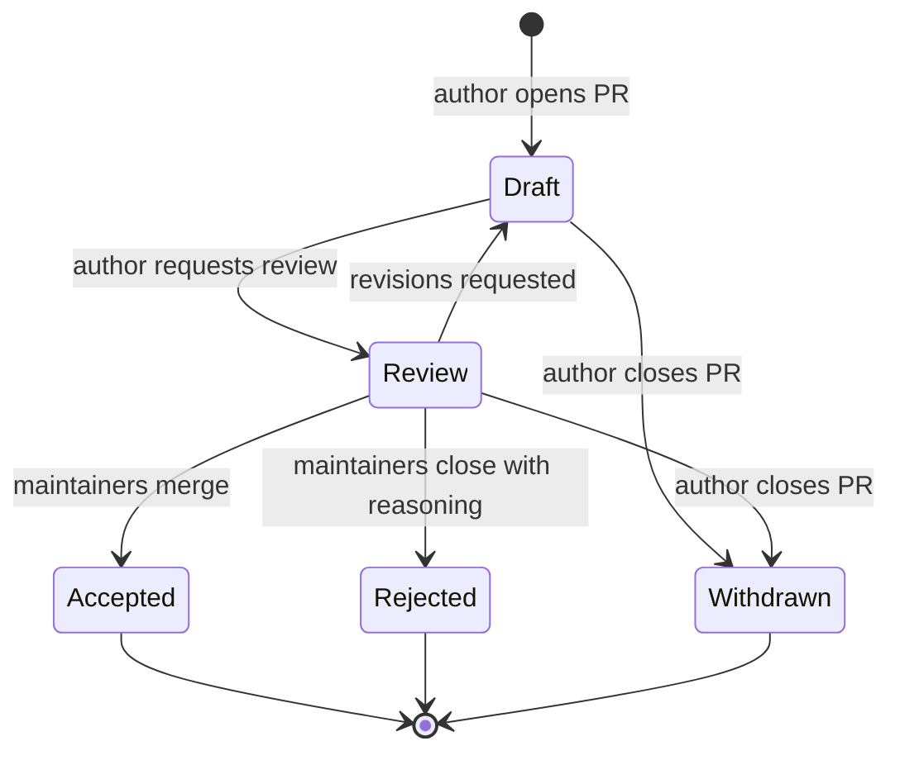

# Contributing to PhiSQL

PhiSQL is a specification *and* a reference implementation, so changes that touch the grammar, the catalogs, or the compile semantics have a wider blast radius than a typical code change: they ripple into every downstream Philterd tool that consumes the spec. To keep the spec moving without fragmenting it, all such changes go through a lightweight **RFC** (Request for Comments) process described below.

Bug fixes, documentation tweaks, new test cases, and clarifications that do not change observable spec behavior do **not** need an RFC. Open a normal pull request.

## Table of contents

- [What needs an RFC](#what-needs-an-rfc)
- [What does not need an RFC](#what-does-not-need-an-rfc)
- [How to file an RFC](#how-to-file-an-rfc)
- [Lifecycle](#lifecycle)
- [Review process and merge authority](#review-process-and-merge-authority)
- [Versioning policy](#versioning-policy)
- [Code of conduct](#code-of-conduct)

## What needs an RFC

The redaction policy schema under [`schema/`](schema/) is the canonical contract; changes are proposed against it. File an RFC for any change that:

- **Adds, removes, or modifies the redaction policy schema** under `schema/` — a new entity type, strategy, field, constraint, or enum value. This changes the contract itself; the catalog, grammar, and reference implementation follow from it. A backward-incompatible schema change is a new schema version (a new `schema/<version>/` directory).
- Adds, removes, or modifies grammar productions in `spec/v0.1/grammar/PhiSQL.g4` or `PhiSQL.ebnf`.
- Changes the catalog files in `spec/v0.1/catalog/` in a way that alters what a conforming compiler must accept or reject (adding an entity type, changing a strategy's allowed arguments, reserving a new keyword).
- Changes how PhiSQL compiles to Phileas JSON (the compile contract documented under `catalog/`).
- Introduces a new statement, clause, or predicate form.
- Defers, retires, or renames an existing language feature.
- Adjusts the policy-naming rule, file-layout convention, or any other normative behavior that downstream consumers rely on.

When in doubt, open an issue first and ask. A maintainer will tell you whether an RFC is needed.

## What does not need an RFC

Open a normal PR for:

- Typo, grammar, and formatting fixes in any document.
- New worked examples under `spec/v0.1/examples/` that exercise *already-specified* grammar.
- Additional reference-implementation tests that lock down *already-specified* behavior.
- Reference-implementation refactoring that does not change observable compile behavior.
- CI/workflow changes that do not affect what the spec accepts or produces.
- Bug fixes where the spec is unambiguous and the implementation diverged from it. (Reference the spec section the fix restores.)

## Changing the schema

The schema under [`schema/`](schema/) is the source of truth for the policy contract, so a change to what a valid policy looks like is, first and foremost, a schema change. An RFC for such a change must:

1. **Update the schema.** Edit `schema/<version>/schema.json` for an additive (backward-compatible) change, or add a new `schema/<new-version>/schema.json` for a backward-incompatible one, bumping the `version` field and `$id` to match.
2. **Update PhiSQL to match.** Reflect the change in the catalog (`spec/v0.1/catalog/`), the grammar, and the reference compiler so PhiSQL can express it and still compiles to valid policy JSON. CI validates every example against the schema in `schema/`.
3. **Account for the runtime.** The schema must not declare anything the Phileas runtime does not implement. Phileas downloads the published schema and embeds it, and a conformance test there fails the build if the schema and the engine drift apart — so a schema addition is complete only once Phileas implements it.

The canonical source is `schema/` in this repository. The copy published at `https://philterd.ai/schemas/redaction-policy/<version>/schema.json` is kept in sync with it; do not edit the published copy directly.

## How to file an RFC

1. **Open an issue first** with the `phisql-rfc` label so the idea can be sanity-checked before you invest time in drafting. A maintainer will confirm it needs an RFC and assign you the next RFC number (`NNNN`, four digits, zero-padded).
2. **Copy the template** from [`.github/RFC_TEMPLATE.md`](.github/RFC_TEMPLATE.md) to `rfcs/NNNN-short-slug.md` on a branch in your fork.
3. **Fill out every section.** Empty sections are a signal the proposal is not ready. If a section genuinely does not apply, write "N/A" and explain in one sentence why.
4. **Open a pull request** titled `RFC NNNN: <short summary>`. Link the originating issue. The PR itself is the discussion thread; comments and revisions happen there.
5. **Iterate.** Reviewers may ask for changes to motivation, grammar, examples, or alternatives. Update the RFC in place — the PR diff is the record of how the design evolved.
6. **Implementation does not block acceptance**, but an RFC must include at least one worked PhiSQL example and, where applicable, the compiled Phileas JSON. The reference implementation lands in a follow-up PR that links back to the RFC.

## Lifecycle

Every RFC moves through these states. The current state lives in the RFC's frontmatter (`status: Draft|Review|Accepted|Rejected|Withdrawn`).

State definitions:

| State       | Meaning                                                                                          |
|-------------|--------------------------------------------------------------------------------------------------|
| **Draft**   | Author is still writing or iterating. Feedback is welcome but the design is not yet stable.      |
| **Review**  | Author considers the RFC ready. Maintainers and the community are explicitly invited to weigh in. Minimum 7 days in this state before acceptance, to give time-zone-spread reviewers a fair chance. |
| **Accepted**| Merged to `main`. The change is now part of the spec on the next release. The RFC file remains in `rfcs/` as the historical record. |
| **Rejected**| Closed without merging. The PR description must state the reason. The RFC may be re-proposed later if circumstances change; a new RFC number is assigned. |
| **Withdrawn**| Author closed the PR before a decision. The number is retired (not re-used) to keep the historical record stable. |

## Review process and merge authority

**Initially (pre-1.0):** Philterd maintainers have merge authority on all RFCs. Acceptance requires:

- At least one maintainer approval on the PR.
- The minimum 7-day Review window has elapsed.
- No unresolved blocking objections from any maintainer.

**Post-1.0:** Merge authority will move to a working group with representation from Philterd and from any organization shipping a conforming implementation. The transition will itself be governed by an RFC.

Reviewers evaluate an RFC against these criteria, in roughly this priority order:

1. **Necessity.** Is there a real problem? Could it be solved without changing the spec (e.g., a library or convention)?
2. **Phileas-JSON representability.** Can the proposed construct compile to existing Phileas JSON, or does it require a Phileas runtime change? The latter raises the bar significantly — see the README's "The policy json schema leads; PhiSQL follows" stance.
3. **Backward compatibility.** Does the change break existing PhiSQL files or existing Phileas JSON policies? Breaking changes are not impossible but require strong justification and a migration story.
4. **Spec clarity.** Are the proposed schema and grammar changes unambiguous? Is the `schema/<version>/schema.json` delta well-formed, does the EBNF match the ANTLR grammar, and does the catalog match the schema?
5. **Coverage.** Are there worked examples? Do they round-trip through the reference compiler?
6. **Alternatives.** Was the design space genuinely explored, or is the proposal the first thing the author thought of?

## Versioning policy

The PhiSQL spec versions live under `spec/v<MAJOR>.<MINOR>/`. There is no patch level on the spec itself — patch-level fixes to text, comments, or example files do not change the version. The reference implementation is versioned independently and follows standard SemVer.

The redaction policy schema is versioned independently of the PhiSQL spec, under `schema/<version>/`. An additive, backward-compatible change edits the current `schema/<version>/schema.json` in place. A backward-incompatible change mints a new `schema/<version>/` directory with the `version` field and `$id` bumped; the previous version stays published so existing policies keep validating. The Phileas version → schema version mapping is recorded in the Phileas README.

A **minor** version bump (`v0.1` → `v0.2`) is warranted when an Accepted RFC:

- Adds a new statement, clause, predicate, entity type, or strategy.
- Adds a new optional argument to an existing strategy.
- Relaxes a previous restriction (formerly-rejected input is now accepted).
- Adds a new catalog file or new fields to an existing one in a backward-compatible way.

A **major** version bump (`v0.1` → `v1.0`, `v1.x` → `v2.0`) is warranted when an Accepted RFC:

- Removes or renames any existing statement, clause, entity, or strategy.
- Tightens a previous permissive rule (formerly-accepted input is now rejected).
- Changes the compiled Phileas JSON output for an existing valid PhiSQL input.
- Reserves a new keyword that could have been used as an identifier in a prior version.
- Changes the policy-naming, file-layout, or any other normative convention downstream consumers rely on.

Pre-1.0 (the current state), the spec is explicitly draft and breaking changes may land within a single minor version. The first `v1.0` release establishes the compatibility contract; from that point, the rules above are binding.

Each accepted RFC must state which kind of bump it requires in its `versioning_impact` frontmatter field. The release manager bundles accepted RFCs into the next version following these rules.

## Code of conduct

This project follows the [Contributor Covenant](https://www.contributor-covenant.org/version/2/1/code_of_conduct/). Be kind, assume good faith, and focus on the proposal rather than the proposer.
